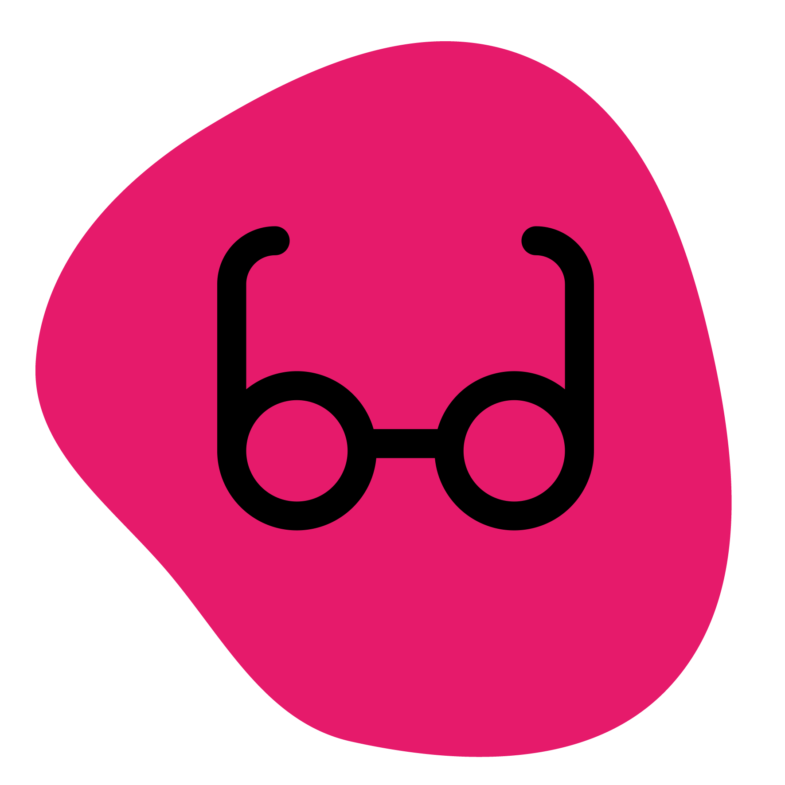

<div style="text-align: center;" align="center">
    
    <h1>VIBES</h1>
<pre> <b>V</b>ariants <b>I</b>nterne <b>BE</b>manning<b>S</b>ystem (v2)</pre> 

<p>Frontend: Next.js / React.js </p> 
<p>Backend: .NET Core v7 RESTful Web-API / EF Core / Azure Edge SQL</p>

</div>

## Motivasjon
* Overordnet mål: Lage nytt internverktøy for bemanning og konsulent-oversikt i Variant.

* Den nye løsningen skal med tiden bytte ut gammel løsning: [Bemanninssystem (v1)](https://github.com/varianter/bemanningssystem)

* Arbeidet er og ment som et større referanse-prosjekt for både utviklere og designere i Variant.

Du kan lese mer dokumentasjon om mål og struktur i [manifestet](docs/MANIFESTO.md) under docs/

## Kjør
For å starte utviklingsmiljø, følg henholdsvis [README.md](frontend/README.md) i frontend og [README.md](backend/README.md) i backend mappene. Avhengig av om du bygger opp databasen selv eller kjører [migreringene](https://github.com/varianter/vibes-data-migration), så burde du sjekke at du selv ligger inne som konsulent med variant-mailen din. Da får man tilgang på ferie-fanen og bilde. 

## Deploy
Kjør actions for deploy i Github Actions for hhv. dev og prod 

### .gitignore bug
Hvis du merker at filer ikke blir ignorert etter at `.gitignore` er oppdatert: Kjør
```shell
git rm -rf --cached .
git add .
```