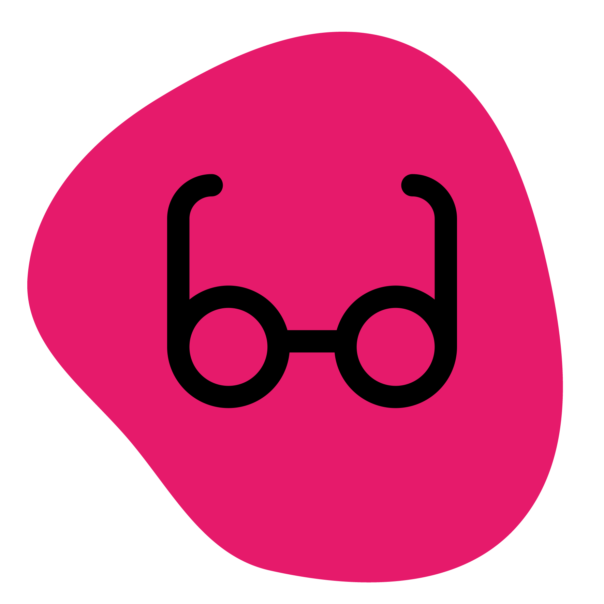

<div style="text-align: center;" align="center">
    
    <h1>VIBES</h1>
<pre> <b>V</b>ariants <b>I</b>nterne <b>BE</b>manning<b>S</b>ystem </pre>
<p>En backend-tjeneste</p> 
<p> .NET Core v7 RESTful Web-API / EF Core / Azure Edge SQL </p>

<p>Inspirert / mini-forket av <a href="https://github.com/varianter/chewbacca">Chewbacca</a></p>
</div>

## Kommandoer

For å kjøre opp dev miljø:

```
dotnet run --project ./RestApi
```

For å kjøre migrering til `VibesDb`:

```bash
# For å kjøre ny migrasjon
 dotnet ef migrations add <navn på migrasjon> --project ./ApplicationCore --startup-project ./RestApi

# Revertere siste migrasjon
 dotnet ef migrations remove --project ./ApplicationCore --startup-project ./RestApi
```

## Struktur

Les mer om Clean Architecture
her: https://learn.microsoft.com/en-us/dotnet/architecture/modern-web-apps-azure/common-web-application-architectures#clean-architecture
